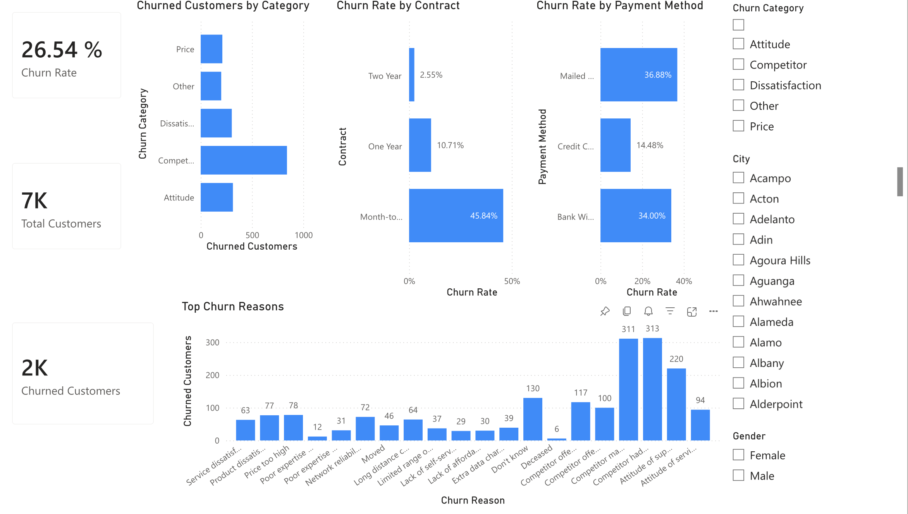

# Customer Churn Analysis (Power BI)

## Project summary (for recruiters)
- **Role:** Business Analyst (portfolio project)
- **Goal:** Understand why customers churn and identify high-risk segments to support retention decisions.
- **Outcome:** Built an interactive Power BI dashboard showing churn KPIs and key churn drivers, and proposed data-driven retention actions.
- **Methods:** Data cleaning (Power Query), KPI design (Churn Rate), segmentation analysis (contract type, payment method), churn category/reason analysis, insight-to-recommendation translation.
- **Key results:** Overall churn rate **26.54%**; highest-risk segment is **month-to-month contracts (45.84% churn)**; churn is strongly associated with payment method and competitor-related reasons.

## Dashboard

## Report
- [Read the full report (PDF)](churn%20analysis.pdf)

## Dataset
Public telco churn dataset with customer attributes and churn outcome (**Churn Label**), plus churn category/reason fields.

## Project goals
- Measure churn performance with KPI tracking
- Identify **high-risk customer segments** (e.g., contract type, payment method)
- Understand the **main churn categories and churn reasons**
- Provide **data-driven retention recommendations**

## What’s included
- Interactive Power BI report with:
  - **Churn Rate**, **Total Customers**, **Churned Customers**
  - Churn segmentation by **Contract** and **Payment Method**
  - Breakdown of churned customers by **Churn Category**
  - **Top Churn Reasons** (counts of churned customers)
  - Slicers for exploration (e.g., churn category, city, gender)

## Key findings (from the dashboard)
- Overall churn rate: **26.54%** (≈2K churned out of ≈7K customers)
- Contract type is a major driver:
  - **Month-to-month:** **45.84%**
  - **One year:** **10.71%**
  - **Two year:** **2.55%**
- Payment method is associated with churn:
  - **Mailed check:** **36.88%**
  - **Bank withdrawal:** **34.00%**
  - **Credit card:** **14.48%**
- Top churn drivers by reason include:
  - **Competitor had better devices (313)**
  - **Competitor made better offer (311)**
  - **Attitude of support person (220)**

## Recommendations
- Convert **month-to-month** customers to longer contracts using targeted incentives (discounts, bundles, loyalty credits).
- Launch competitive **device/offer** campaigns to address competitor-driven churn.
- Improve **support experience** (training + quality monitoring) to reduce churn tied to service interactions.
- Encourage lower-churn payment behaviors (e.g., autopay/credit card) with small rewards.
- Improve churn-exit data capture to reduce “Don’t know” reasons and strengthen retention targeting.

## Tools
- Power BI (Power Query + DAX measures)
- Data visualization and dashboard design

## How to use
Open the Power BI report and use slicers to explore churn patterns by different customer segments.
